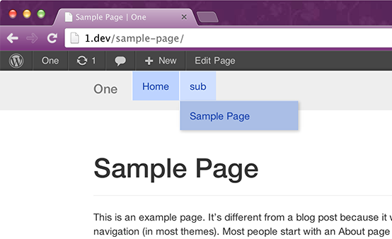

# Roots Theme — Backbone Example

This branch shows how to use [backbone.js](http://backbonejs.org/) with [Roots Theme](http://www.rootstheme.com/).

Derrived from the [Backbone.js TodoMVC Example](https://github.com/tastejs/todomvc/tree/gh-pages/architecture-examples/backbone#backbonejs-todomvc-example).

## [bower](https://github.com/bower/bower)

`cd assets/js/ && bower update`

## Explanation

* Adds many JavaScript files to `assets/js`
* Enables front page sidebar in [config.php](lib/config.php)
* Enhances JavaScript enqueue in [scripts.php](lib/scripts.php#L32-L61).
* Creates template files:
    * [base-front-page.php](base-front-page.php)
    * [front-page.php](front-page.php)
    * [templates/header-front-page.php](templates/header-front-page.php)
    * [templates/content-front-page.php](templates/content-front-page.php)
    * [templates/sidebar-front-page.php](templates/sidebar-front-page.php)

## Screenshot

